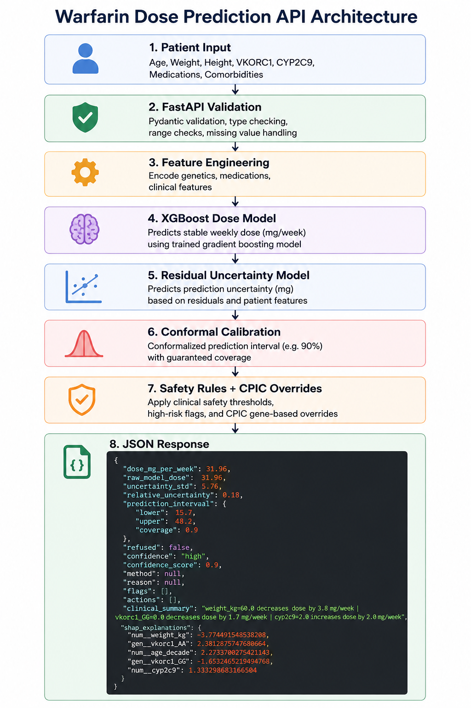

# Warfarin Dose Prediction – Clinical AI System

Clinical machine learning system for personalized warfarin dosing using pharmacogenomics, explainability, uncertainty estimation, and conformal prediction.

Research prototype only — NOT for clinical use.

---

## Current Performance (v1.2.0)

| Metric | IWPC Clinical | XGBoost |
|---|---|---|
| MAE (mg/week) | 11.97 | 9.64 |
| Within-20% Accuracy | 16.3% | 41.8% |
| High-Risk MAE | 10.85 | 7.81 |
| Conformal Coverage | - | 92.1% |
| Refusal Rate | - | 13.1% |

---

## Key Features

- XGBoost dose prediction
- Pharmacogenomic modeling (VKORC1, CYP2C9)
- SHAP explainability
- Residual uncertainty estimation
- Conformal prediction intervals
- Prediction refusal system
- FastAPI deployment
- CPIC-inspired safety overrides
- Clinical safety flags
- Out-of-distribution detection

---

## System Architecture



Pipeline:

Clinical Input → FastAPI Validation → Feature Engineering → XGBoost Dose Prediction → Residual Uncertainty Model → Conformal Calibration → Safety Rules → JSON Response

---

## Example Prediction

### Request

```json
{
  "gender": "male",
  "race": "white",
  "age": "50-59",
  "weight_kg": 60,
  "height_cm": 161,
  "vkorc1": "AA",
  "cyp2c9": "*1/*1",
  "amiodarone": 0,
  "aspirin": 0,
  "rifampin": 0,
  "diabetes": 0,
  "hypertension": 0,
  "comorbidities": "'heart_failure'",
  "medications": "'simvastatin'"
 
}
Response:
{

"dose_mg_per week": 31.96,

"raw model_dose": 31.96,

"uncertainty_std": 5.76,

"relative_uncertainty": 0.18,

"prediction_interval": {

"lower": 15.7,

"upper": 48.2,

"coverage": 0.9

},

"refused": false,

"confidence": "high"

"confidence_score": 0.9,

"method": null,

"reason": null,

"flags": [],

"actions": [],

"clinical_summary": "weight_kg=60.0 decreases dose by 3.8 mg/ vkorc1_GG=0.0 decreases dose by 1.7mg"

"shap_explanations": (

"num_weight_kg": -3.77,

"gen_vkorc1_AA": 2.38,

"num_age_decade":2.27,

vkorc1_GG*: -1.65,

"num_cyp2c9": 1.33)

}


Conformal Prediction

Version 1.2.0 introduced:

residual uncertainty modeling
conformal calibration
prediction intervals
refusal logic
Calibration results:


Metric

Value

q90

2.931

Coverage

92.1%

Refusal Rate

13.1%

Median PI Width

36.1 mg/week


High-dose patients demonstrated:

wider intervals
larger uncertainty
increased refusal frequency
This aligned with subgroup instability and hard-case analysis.

See:

CONFORMAL.md
PREDICTION_INTERVAL_DRIFT.md


Main Findings

Weight and BMI were dominant drivers of prediction error
Missing VKORC1 strongly increased uncertainty
High-dose patients (>49 mg/week) were hardest to predict
Rare CYP2C9 genotypes remained underrepresented
Uncertainty intervals widened appropriately in difficult patients


Safety Features

CPIC-inspired genotype overrides
Dose capping
Prediction refusal
Missing-genetics warnings
Confidence scoring
SHAP explanations
Input validation
See:

CPIC_OVERRIDE.md
LIMITATIONS.md
MODEL_CARD.md

REPOSITORY STRUCTURE

WARFARIN_IWPC_PROJECT/
├── .gitignore
├── CHANGELOG.md
├── Dockerfile
├── LICENSE
├── README.md
├
├── data/
│    ├── processed_data
│    ├── raw_data
│    
├── docs/
│   ├── CONFORMAL.md
│   ├── CPIC_OVERRIDE.md
│   ├── LIMITATIONS.md
│   ├── MODEL_CARD.md
│   ├── PREDICTION_INTERVAL_DRIFT.md
│   ├── VALIDATION_PLAN.md
│
├── figures/
│   ├── v1.0.0/
│   ├── v1.1.0/
│   └── v1.2.0/
│
│
├── models/
│   ├── v1.0.0/
│   ├── v1.1.0/
│   └── v1.2.0/
│
│
├── notebooks/
│
├── reports/
    ├── clinical_report.txt
│   ├── clinical_validation_report.txt
│   ├──  hard_cases_analysis.md
│   ├── shap_analysis.md
│   └── subgroup_analysis.md
│──requirements.txt
├── results/
│   ├── v1.0.0/
│   ├── v1.1.0/
│   └── v1.2.0/
│
├── screenshots/
├── scripts/
│   ├── evaluate_conformal.py
│   ├── run_api.py
│   └── train.py
│
├── src/
│   ├── api/
│   │   ├── api_utils.py
│   │   ├── main.py
│   │   ├── schemas.py
│   │   └── validation.py
│   │
│   ├── core/
        ├── analysis/
│   │   ├── data_cleaning.py
│   │   ├── data_loading.py
│   │   ├── data_splitting.py
│   │   ├── evaluations.py
│   │   ├── explainibility.py
│   │   ├── features.py
│   │   ├── modeling.py
│   │   ├── preprocess.py
│   │   ├── uncertainty.py
│   │   └── visualizations.py
│   │
│   └── utils/
│       ├── config.py
│       └── utils.py
└── setup.py
│
└── tests/

Run Locally
pip install -r requirements.txt
python -m scripts.run_api
Swagger Docs
http://127.0.0.1:8000/docs
Run with Docker
docker build -t warfarin-api .
docker run -p 8000:8000 warfarin-api
Swagger Docs
http://localhost:8000/docs

Documentation

MODEL_CARD.md
CONFORMAL.md
LIMITATIONS.md
VALIDATION_PLAN.md
CPIC_OVERRIDE.md
PREDICTION_INTERVAL_DRIFT.md
CHANGELOG.md
REPORTS


Disclaimer

Research prototype only.

NOT:

FDA approved
CE marked
validated for patient care
Requires prospective clinical validation before deployment.


Version History

v1.2.0

Added conformal prediction
Added residual uncertainty model
Added prediction refusal logic
Added drift monitoring documentation
v1.1.0

Added CPIC safety overrides
Added limitations/governance documentation
v1.0.0

Initial XGBoost dosing system
SHAP explainability
FastAPI deployment
